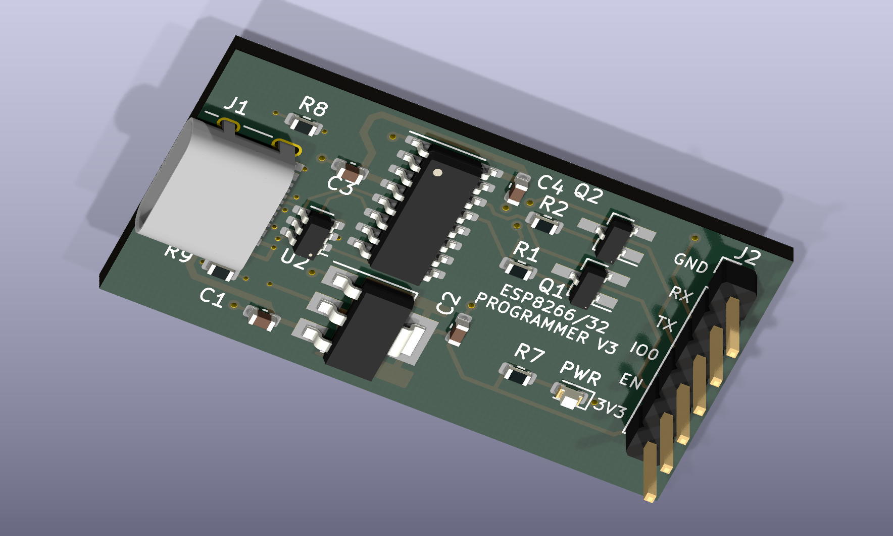

# ESPFLASHER
Inexpensive ESP32/ESP8266 programmer

This device implements a USB programmer for ESP32/ESP8266 devices with traditional programming pin management (EN/BOOT0) using [RTS DTR bridge][1].

It also differs from traditional USB-UART converters by a powerful LDO, which allows you to easily power the ESP32 / ESP8266 and related peripherals.
Earlier revisions were manufactured by JLCPCB and tested for programming various devices.

**V3 has not been tested on physical hardware (IRL) yet.** It uses [USB-C with USB 2.0 data](docs/usb-c.md), corrects the header labels and board-edge clearance, uses a ceramic-compatible TI regulator, and retains a single power LED beside the programming header. The RX/TX activity LEDs and their drivers have been removed. It has passed the KiCad checks described in [the revision notes](docs/revision-3.md). Gerbers, BOM and CPL are included.

[1]: https://raw.githubusercontent.com/nodemcu/nodemcu-devkit/master/Documents/NODEMCU_DEVKIT_SCH.png "Also called Node-MCU auto-program circuit"
