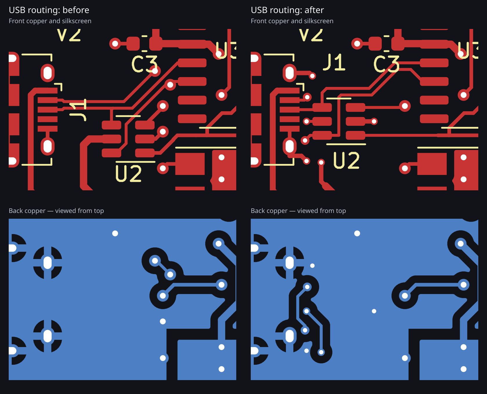

# USB routing comparison

These are historical views of the Micro-USB routing change, before the later
removal of the RX/TX indicators, relocation of the power LED, and USB-C conversion. See the
[current board preview](../ESPFLASHER-v3.png) and [revision notes](../revision-3.md)
for the final V3 layout. The [USB-C conversion](../usb-c.md) supersedes the
connector placement and routing shown here.

These images are generated directly from the KiCad PCB. The before views show
the V2 board immediately before this USB routing change, including the earlier
header-label, regulator and board-edge fixes. Before/after views use identical
camera settings or drawing viewports. Back copper is viewed from the top, so its
features line up with the front layer above it.

| View | Before | After |
| --- | --- | --- |
| Full front copper and silkscreen | [Before](before.png) | [After](after.png) |
| Full board 3D render | [Before](before-3d.png) | [After](after-3d.png) |

U2 moves 2.14 mm toward J1 and 1.20 mm upward, with no rotation. Both USB traces
now enter and leave their respective U2 pads rather than connecting protection
through branch traces. The pad assignments and all schematic connections remain
unchanged. The other U2 channels and its supply are rerouted to the new position.

The connector and CH340 have opposite D+/D− pad order. The two-via D− crossover
is now on the connector side of U2, leaving the main protected USB run on the
front layer. That run uses 0.20 mm tracks with 0.25 mm edge-to-edge spacing on
its paired sections, then fans out to the CH340 pads. There are no length-tuning
meanders. Ground vias beside the connector shell connections stitch the layers
near the crossover, and U2 has a short connection to a ground via beside pin 2.

The existing 0.20 mm trace width is retained. This is not a claim of verified
90-ohm differential impedance: that requires a specified fabrication stackup and
an impedance calculation. The back ground fill is continuous under the main
paired route, checked against the filled copper geometry.

KiCad DRC reports no new violations, no unconnected pads and no schematic/PCB
parity issues. The existing J1 footprint-type error and nine footprint-library
warnings remain. Only U2 changes position; all components retain their pin-net
assignments and orientation. Both assembly position files, Gerber archives and
the IPC netlist are updated.

**The current V3 revision remains untested on physical hardware.** USB enumeration, repeated flashing
and ESD performance have not been bench-validated.
